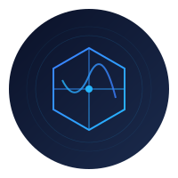

# DeepChain

<div align="center">
  
  <h3>Deep Seek AI-Driven Strategies, Blockchain-Verified Trust</h3>
  <p>Powered by DeepSeek AI</p>
</div>

## Overview

DeepChain is a framework for building decentralized AI trading strategy engines. It combines reinforcement learning, blockchain technology, and edge computing to create transparent, secure, and efficient trading systems. The framework is powered by DeepSeek AI, a pioneering company in quantitative trading that has revolutionized the AI, financial, and cryptocurrency industries through their innovative approaches to AI-driven trading.

## Key Features

- **Reinforcement Learning-Driven Dynamic Strategies**
  - Real-time strategy adaptation using DeepSeek's R1 training system
  - Comprehensive market data processing and analysis
  - Advanced technical indicators and signal generation
  - Automated strategy optimization

- **Distributed Strategy Validation Network**
  - Blockchain-based strategy verification
  - Zero-knowledge proof integration
  - Multi-chain support (Solana, Ethereum, BNB Chain, Base)
  - Transparent and tamper-proof execution records

- **Edge Model Deployment**
  - Knowledge distillation for model compression
  - Optimized deployment for mobile and IoT devices
  - Real-time inference with minimal latency
  - Efficient on-chain settlement

- **Comprehensive Monitoring System**
  - Real-time performance tracking
  - Automated alert system
  - Resource usage monitoring
  - System health checks

## Technology Stack

- **AI & Machine Learning**
  - PyTorch for deep learning models
  - DeepSeek's R1 system for reinforcement learning
  - NumPy and Pandas for data processing
  - Scikit-learn for feature engineering

- **Blockchain Integration**
  - Solana Web3.js
  - Ethereum Web3.py
  - Zero-knowledge proof libraries
  - Multi-chain support SDKs

- **Edge Computing**
  - ONNX Runtime
  - TensorRT
  - Model compression tools
  - Edge deployment utilities

## Project Structure

```
deepchain/
├── assets/                  # Project assets
│   ├── images/            # Image resources
│   └── logo.svg          # Project logo
├── deepchain/              # Main package directory
│   ├── core/             # Core functionality
│   │   ├── strategy/    # Trading strategy interfaces
│   │   │   ├── base.py       # Base strategy classes
│   │   │   └── rl.py         # Reinforcement learning strategies
│   │   ├── blockchain/  # Blockchain interaction interfaces
│   │   │   ├── validator.py  # Strategy validation
│   │   │   ├── chains.py     # Multi-chain support
│   │   │   └── ethereum.py   # Ethereum integration
│   │   ├── edge/       # Edge deployment interfaces
│   │   │   ├── deployer.py   # Model deployment
│   │   │   └── optimizer.py  # Model optimization
│   │   ├── data/       # Data processing and streaming
│   │   │   ├── stream.py     # Data streaming
│   │   │   └── indicators.py # Technical indicators
│   │   └── monitoring/ # System monitoring and alerts
│   │       ├── metrics.py    # Metrics collection
│   │       ├── alerts.py     # Alert management
│   │       └── performance.py# Performance tracking
│   ├── protocols/       # Protocol definitions
│   │   ├── trading.py  # Trading protocols
│   │   └── validation.py# Validation protocols
│   └── utils/          # Utility functions
│       ├── config.py   # Configuration management
│       ├── logging.py  # Logging utilities
│       └── errors.py   # Error handling
├── examples/            # Example implementations
│   ├── strategies/     # Strategy examples
│   │   ├── simple_strategy.py    # Basic strategy example
│   │   └── advanced_strategy.py  # Advanced strategy example
│   ├── validation/     # Blockchain validation examples
│   │   ├── solana_example.py     # Solana validation
│   │   └── ethereum_example.py   # Ethereum validation
│   └── deployment/     # Edge deployment examples
│       ├── mobile_deployment.py  # Mobile deployment
│       └── iot_deployment.py     # IoT deployment
├── tests/              # Test cases
│   ├── unit/          # Unit tests
│   │   ├── test_strategy.py     # Strategy tests
│   │   ├── test_blockchain.py   # Blockchain tests
│   │   └── test_deployment.py   # Deployment tests
│   └── integration/   # Integration tests
│       ├── test_workflow.py     # Workflow tests
│       └── test_performance.py  # Performance tests
├── docs/              # Documentation
│   ├── getting_started.md      # Getting started guide
│   ├── api_reference.md        # API documentation
│   ├── strategy_development.md # Strategy guide
│   ├── blockchain_integration.md# Blockchain guide
│   ├── edge_deployment.md      # Deployment guide
│   ├── monitoring.md           # Monitoring guide
│   ├── contributing.md         # Contributing guide
│   └── security.md             # Security policy
├── requirements.txt    # Project dependencies
├── setup.py           # Package configuration
├── LICENSE            # License information
└── README.md          # Project documentation
```

## Installation

```bash
pip install deepchain
```

## Quick Start

1. **Install Dependencies**
```bash
pip install -r requirements.txt
```

2. **Configure Environment**
```bash
export DEEPSEEK_API_KEY=your_api_key
export BLOCKCHAIN_RPC_URL=your_rpc_url
```

3. **Run Example Strategy**
```python
from deepchain.examples.strategies import SimpleStrategy
from deepchain.core.blockchain import SolanaValidator

# Initialize strategy and validator
strategy = SimpleStrategy()
validator = SolanaValidator()

# Train and deploy strategy
strategy.train()
validator.register_strategy(strategy)
```

Check out our [examples](./examples) directory for more implementation examples.

## Documentation

- [Getting Started Guide](./docs/getting_started.md)
- [API Reference](./docs/api_reference.md)
- [Strategy Development](./docs/strategy_development.md)
- [Blockchain Integration](./docs/blockchain_integration.md)
- [Edge Deployment](./docs/edge_deployment.md)
- [Monitoring System](./docs/monitoring.md)

## Acknowledgments

DeepChain is powered by DeepSeek AI, a leading innovator in quantitative trading. We extend our heartfelt gratitude to DeepSeek for their groundbreaking contributions:

- Revolutionizing AI-driven trading through advanced reinforcement learning
- Pioneering transparent and verifiable trading strategies
- Advancing the integration of AI and blockchain technology
- Democratizing access to sophisticated trading technologies

DeepSeek's commitment to innovation has transformed the landscape of AI, finance, and cryptocurrency trading, making advanced trading strategies accessible and trustworthy.

## Contributing

We welcome contributions! Please see our [contributing guidelines](./docs/contributing.md) for details.

## Security

Please report any security issues to security@deepchain.io. See our [security policy](./docs/security.md) for details.

## Community

- [Twitter](https://x.com/DeepChain_AI)

## License

This project is licensed under the MIT License - see the [LICENSE](./LICENSE) file for details. 